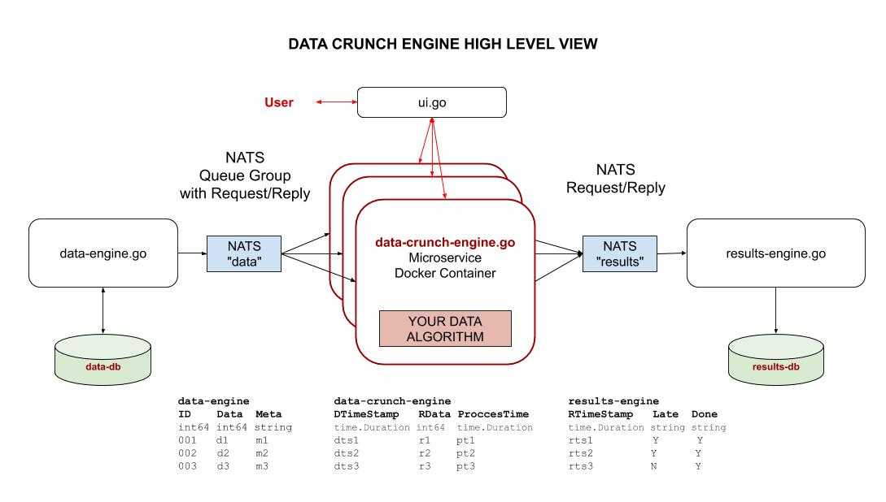
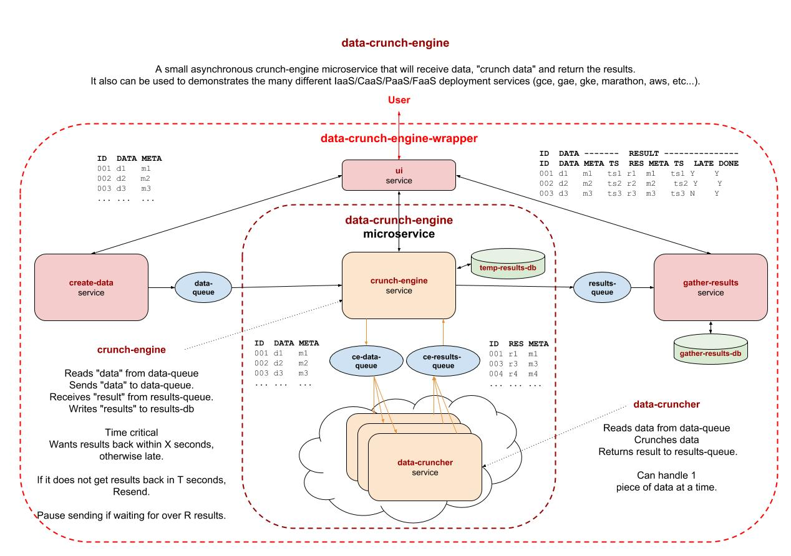

# data-crunch-engine

```text
*** THE REPO IS UNDER CONSTRUCTION - CHECK BACK SOON ***
```

[](https://goreportcard.com/report/github.com/JeffDeCola/data-crunch-engine)
[](https://godoc.org/github.com/JeffDeCola/data-crunch-engine)
[](https://codeclimate.com/github/JeffDeCola/data-crunch-engine/maintainability)
[](https://codeclimate.com/github/JeffDeCola/data-crunch-engine/issues)
[](http://jeffdecola.mit-license.org)

_A lightweight asynchronous microservice that will receive data,
crunch data and return the results. You provide the data crunching algorithm._

Table of Contents,

* [PREREQUISITES](https://github.com/JeffDeCola/data-crunch-engine#prerequisites)
* [RUN](https://github.com/JeffDeCola/data-crunch-engine#run)
* [CREATE BINARY](https://github.com/JeffDeCola/data-crunch-engine#create-binary)
* [OVERVIEW](https://github.com/JeffDeCola/data-crunch-engine#overview)
* [PROTOCOL COMPILE FOR GO](https://github.com/JeffDeCola/data-crunch-engine#protocol-compile-for-go)
* [RUN USING GO](https://github.com/JeffDeCola/data-crunch-engine#run-using-go)
* [CONTINUOUS INTEGRATION & DEPLOYMENT](https://github.com/JeffDeCola/data-crunch-engine#continuous-integration--deployment)
  * [STEP 1 - TEST](https://github.com/JeffDeCola/data-crunch-engine#step-1---test)
  * [STEP 2 - BUILD (DOCKER IMAGE VIA DOCKERFILE)](https://github.com/JeffDeCola/data-crunch-engine#step-2---build-docker-image-via-dockerfile)
  * [STEP 3 - PUSH (TO DOCKERHUB)](https://github.com/JeffDeCola/data-crunch-engine#step-3---push-to-dockerhub)
  * [STEP 4 - DEPLOY (TO MARATHON)](https://github.com/JeffDeCola/data-crunch-engine#step-4---deploy-to-marathon)

Documentation and references,

* The `data-crunch-engine`
  [Docker Image](https://hub.docker.com/r/jeffdecola/data-crunch-engine)
  on DockerHub

[GitHub Webpage](https://jeffdecola.github.io/data-crunch-engine/)
_built with
[concourse ci](https://github.com/JeffDeCola/data-crunch-engine/blob/master/ci-README.md)_

## PREREQUISITES

I used the following language,

* [go](https://github.com/JeffDeCola/my-cheat-sheets/tree/master/software/development/languages/go-cheat-sheet)

To build a docker image you will need docker on your machine,

* [docker](https://github.com/JeffDeCola/my-cheat-sheets/tree/master/software/operations-tools/orchestration/builds-deployment-containers/docker-cheat-sheet)

To push a docker image you will need,

* [DockerHub account](https://hub.docker.com/)

To deploy to `mesos/marathon` you will need,

* [marathon](https://github.com/JeffDeCola/my-cheat-sheets/tree/master/software/operations-tools/orchestration/cluster-managers-resource-management-scheduling/marathon-cheat-sheet)
* [mesos](https://github.com/JeffDeCola/my-cheat-sheets/tree/master/software/operations-tools/orchestration/cluster-managers-resource-management-scheduling/mesos-cheat-sheet)

As a bonus, you can use Concourse CI,

* [concourse](https://github.com/JeffDeCola/my-cheat-sheets/tree/master/software/operations-tools/continuous-integration-continuous-deployment/concourse-cheat-sheet)

## RUN

The following steps are located in
[run.sh](https://github.com/JeffDeCola/data-crunch-engine/blob/master/code/run.sh).

To run
[main.go](https://github.com/JeffDeCola/data-crunch-engine/blob/master/code/main.go)
from the command line,

```bash
cd code
go run main.go
```

Every 2 seconds it will print,

```bash
Hello everyone, count is: 1
Hello everyone, count is: 2
Hello everyone, count is: 3
etc...
```

## CREATE BINARY

The following steps are located in
[create-binary.sh](https://github.com/JeffDeCola/data-crunch-engine/blob/master/code/bin/create-binary.sh).

You can create a binary, but this will not be used
since it's created during the docker image build.

```bash
cd code
go build -o bin/data-crunch main.go
cd bin
./data-crunch
```

## OVERVIEW

This `data-crunch-engine` is,

* Written in go
* Utilizes goroutines (concurrency)
* Uses protobuf over NATS for messaging
* Built to a lightweight Docker Image

This illustration shows a high level view,



Notice that you may have multiple `data-crunch-engine`s running.

And a more detailed view of the data-crunch engine,



## PROTOCOL COMPILE FOR GO

The protocol buffer human readable file is located
[here](https://github.com/JeffDeCola/data-crunch-engine/blob/master/proto/messages.proto)

The two interfaces have been defined as,

```go
// Check your error
func checkErr(err error) {
    if err != nil {
        log.Fatal("ERROR:", err)
    }
}
```

```proto
message MyData {
    int64 ID = 1;
    int64 Data = 2;
    string Meta = 3;
}
```

```proto
message MyResult {
    int64 ID = 1;
    int64 Data = 2;
    string Meta = 3;
    google.protobuf.Timestamp DTimeStamp = 4;
    int64 RData = 5;
    google.protobuf.Timestamp ProcessTime = 6;
}
```

This file has already been compiled, but you may recompile it using the shell script.

## RUN USING GO

Lets run this thing using go. Then we will go threw the process of
creating a docker image and deploying.

First, start your NATS server,

```bash
nats-server -DV -p 4222 -a 127.0.0.1
```

In separate terminals start the `data-engine`, the `data-crunch-engine`
and the `results-engine` respectively,

```bash
go run data-engine.go messages.pb.go
go run data-crunch-engine.go messages.pb.go
go run results-engine.go messages.pb.go
```

## CONTINUOUS INTEGRATION & DEPLOYMENT

Refer to
[ci-README.md](https://github.com/JeffDeCola/data-crunch-engine/blob/master/ci-README.md)
on how I automated this process.

### STEP 1 - TEST

The following steps are located in
[unit-tests.sh](https://github.com/JeffDeCola/data-crunch-engine/tree/master/code/test/unit-tests.sh).

To unit test the code,

```bash
cd code
go test -cover ./... | tee test/test_coverage.txt
cat test/test_coverage.txt
```

To create `_test` files,

```bash
gotests -w -all main.go
```

### STEP 2 - BUILD (DOCKER IMAGE VIA DOCKERFILE)

The following steps are located in
[build.sh](https://github.com/JeffDeCola/data-crunch-engine/blob/master/code/build-push/build.sh).

We will be using a multi-stage build using a
[Dockerfile](https://github.com/JeffDeCola/data-crunch-engine/blob/master/code/build-push/Dockerfile).
The end result will be a very small docker image around 13MB.

```bash
cd code
docker build -f build-push/Dockerfile -t jeffdecola/data-crunch-engine .
```

You can check and test this docker image,

```bash
docker images jeffdecola/data-crunch-engine:latest
docker run --name data-crunch-engine -dit jeffdecola/data-crunch-engine
docker exec -i -t data-crunch-engine /bin/bash
docker logs data-crunch-engine
```

#### Stage 1

In stage 1, rather than copy a binary into a docker image (because
that can cause issue), **the Dockerfile will build the binary in the
docker image.**

If you open the DockerFile you can see it will get the dependencies and
build the binary in go,

```bash
FROM golang:alpine AS builder
RUN go get -d -v
RUN go build -o /go/bin/data-crunch-engine main.go
```

#### Stage 2

In stage 2, the Dockerfile will copy the binary created in
stage 1 and place into a smaller docker base image based
on `alpine`, which is around 13MB.

### STEP 3 - PUSH (TO DOCKERHUB)

The following steps are located in
[push.sh](https://github.com/JeffDeCola/data-crunch-engine/blob/master/code/build-push/push.sh).

If you are not logged in, you need to login to dockerhub,

```bash
docker login
```

Once logged in you can push to DockerHub,

```bash
docker push jeffdecola/data-crunch-engine
```

Check the
[data-crunch-engine](https://hub.docker.com/r/jeffdecola/data-crunch-engine)
docker image at DockerHub.

### STEP 4 - DEPLOY (TO MARATHON)

The following steps are located in
[deploy.sh](https://github.com/JeffDeCola/data-crunch-engine/blob/master/code/deploy-marathon/deploy.sh).

Pull the `data-crunch-engine` docker image
from DockerHub and deploy to mesos/marathon.

This is actually very simple, you just PUT the
[app.json](https://github.com/JeffDeCola/data-crunch-engine/blob/master/code/deploy-marathon/app.json)
file to mesos/marathon. This .json file tells marathon what to do.

```bash
cd deploy-marathon
curl -X PUT http://192.168.20.117:8080/v2/apps/data-crunch-long-running \
-d @app.json \
-H "Content-type: application/json"
```
